# Инструкция по созданию симулятора БЛА

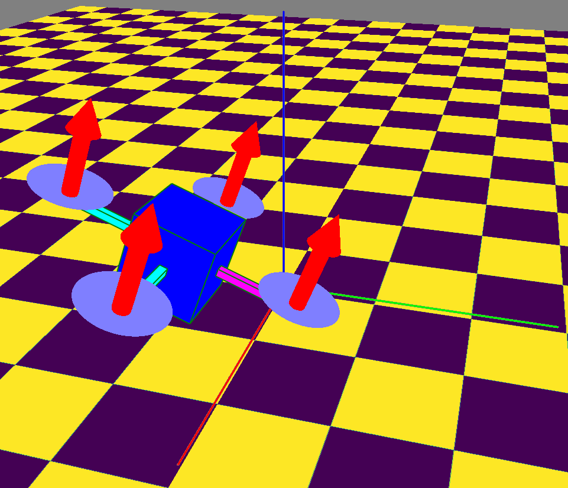
Cкриншот: [GitLab](https://about.gitlab.com) / Skillbox

В этой практической работе вам предстоит создать систему моделирования квадрокоптера. В ходе выполнения задания вы поймёте, как функционируют симуляторы и системы управления, рассмотрите систему стабилизации угловыми скоростями, угловым и пространственным положением ЛА и научитесь применять алгоритм смешивания команд. Этот проект — продолжение практической работы из модуля 3, но в этот раз вы используете полноценную модель динамики мультикоптера и создадите систему управления положением и ориентацией ЛА. Впоследствии вы сможете дальше развивать этот проект, добавлять в него собственные системы управления и тестировать их, менять и улучшать модель динамики.


## Модель динамики БЛА


Рассмотрим модель динамики квадрокоптера. Уравнение для поступательного движения выведено на основе второго закона Ньютона и выглядит следующим образом:


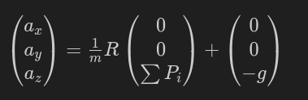

Здесь и далее — изображения Михаила Колодочки.

В нашем случае в правой части уравнения указана сумма ускорений, которые возникают из-за работы двигателей в проекции на стартовой системе координат, и ускорения свободного падения. Чтобы вычислить силы, создаваемые двигателями, воспользуемся выражением для модели динамики двигателя:

$$\sum P_i = b \cdot \sum_{i=1}^{n}\omega_i^2$$

$b$ — коэффициент тяги двигателя,
$\omega_i^2$ — квадрат угловой скорости i-го
двигателя (например, у квадрокоптера четыре двигателя).


Для динамики вращательного движения нам понадобится определить соотношение на основе
уравнений Эйлера:

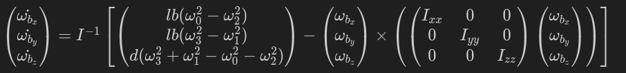

В модели вращательного движения вычисляем угловое ускорение аппарата: **l** — длина базы лучей от двигателя до центра масс ЛА (м), на которой расположены двигатели; **b** — коэффициент тяги двигателя с воздушным винтом (trust coef); **d** — коэффициент момента пропеллера (drag coeff), зависит от геометрии воздушного винта.


$\omega_{b_x}   \omega_{b_y}   \omega_{b_z}$ — угловая скорость ЛА (рад/сек).

$I_{xx}   I_{yy}   I_{zz}$ — осевой момент инерции ЛА (Н/м^2).
Обратите внимание, что знак «×» обозначает векторное произведение.


## Система управления квадрокоптером

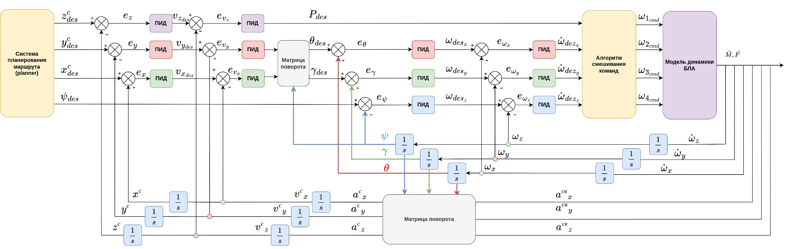

 

Для управления ЛА нужно рассчитать параметры управления аппаратом: требуемую угловую скорость (в канале крена, тангажа и рыскания) и тягу (уровень газа). Структуру системы управления в виде схемы вы найдёте в приложении к практическому заданию.


В качестве системы регулирования используйте каскадный ПИД-регулятор. Для управления высотой аппарата (положением по оси Z стартовой СК) примените контур управления с обратной связью по положению вдоль оси Z и контур по скорости вдоль оси стартовой СК.


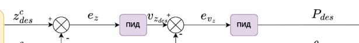

Контур управления высотой.  


Ко входу контура приходит целевое положение $Z_{des}^c$ от системы планирования маршрута (задающие воздействия могут быть установлены пользователем в качестве целевого положения).
Для управления угловой скоростью ЛА используется контур управления с
обратной связью по угловой скорости.


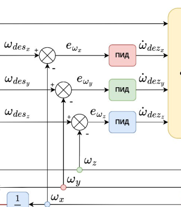

Контуры управления угловой скоростью БЛА.   


В симуляторе получите угловые скорости за счёт интегрирования угловых ускорений аппарата, которые вы вычислили с помощью функций правых частей в уравнении для вращательного движения БЛА. Целевая угловая скорость приходит от контура управления угловым положением.


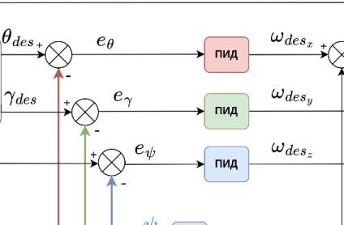

Контуры управления угловым положением БЛА.   


Для управления пространственным положением БЛА нужно изменить угловое положение, чтобы двигаться вдоль осей X и Y стартовой СК.


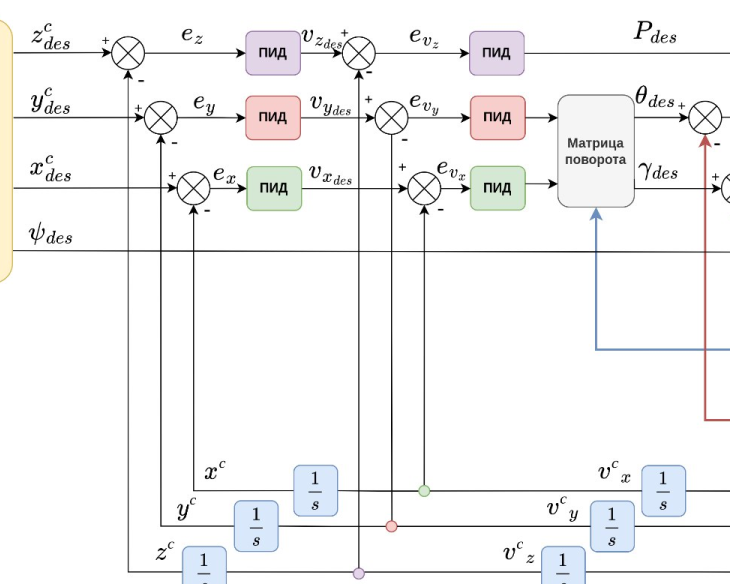
Контуры управления пространственным положением и скоростью БЛА.   


## Параметры модели БЛА

Параметры модели динамики ЛА (коэффициенты для аппарата Parrot Mini):

|Name |Value|
|---|---|
| Шаг интегрирования симулятора (сек)| **simulationStep**: 0.01|
| Время симуляции | **simulationTotalTime**: 1000|
| Масса аппарата (кг) | **mass**: 0.0630 |
| Коэффициент тяги двигателей | **b**: 3.9865e-08 |
| Коэфициент сопротивления при вращении ротора | **d**: 7.5e-10 |
| Длина лучей мультикоптера | **lengthOfFlyerArms**: 0.085 |
| Количество роторов | **numberOfRotors**: 4 |
| Диагональные элементы тензора инерции (осевые моменты инерции) | **Ixx**: 5.82857000000000e-05; **Iyy**: 7.16914000000000e-05; **Izz**: 0.000100000000000000|
| Ограничение по скорости вращения роторов (рад/сек) | **maxVelocityRotors**: 2631; **minVelocityRotors**: 0 |


## Алгоритм смешивания команд

Чтобы получить вектор управления ЛА от системы управления, нужно сформировать команды управления для регуляторов оборотов двигателей и учесть требуемые параметры управления. Сформировать команды управления силовой установкой можно с помощью алгоритма смешивания команд (mixer), так как двигатели влияют на движение аппарата сразу в нескольких каналах управления.

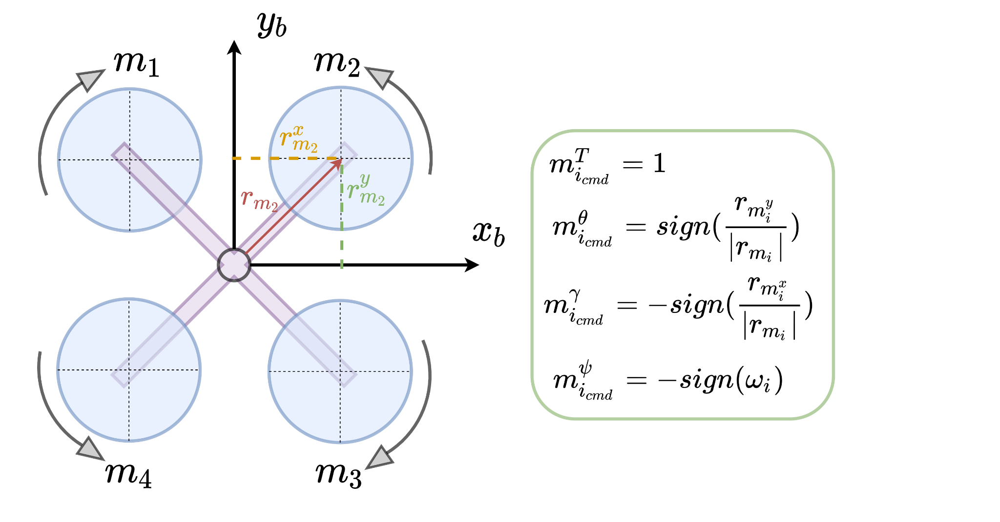

Алгоритм смешивания команд.

Алгоритм смешивания команд позволяет сформировать матрицу коэффициентов влияния двигателей на команды управления. С помощью умножения команд управления на эту матрицу вычисляется нормированная сумма коэффициентов, которая формирует команды управления для каждого двигателя мультироторной системы. На изображении выше показан алгоритм получения матрицы коэффициентов для команд управления мультикоптером, двигатели которого находятся в одной плоскости. По этому алгоритму получаем матрицу коэффициентов квадрокоптера конфигурации X (икс).


||Thrust cmd|Pitch cmd|Roll cmd|Yaw cmd|
|---|---|---|---|---|
|m1|1|1|1|1|
|m2|1|1|1|1|
|m3|1|1|1|1|
|m4|1|1|1|1|


После того как мы получили параметры управления от САУ, сформируем команды
для каждого двигателя.

$m_{1_{cmd}} = T_{cmd} + \theta_{cmd}+\gamma_{cmd} - \psi_{cmd}$

$m_{2_{cmd}} = T_{cmd} + \theta_{cmd}-\gamma_{cmd} + \psi_{cmd}$

$m_{3_{cmd}} = T_{cmd} - \theta_{cmd}- \gamma_{cmd} - \psi_{cmd}$

$m_{4_{cmd}} = T_{cmd}-\theta_{cmd}+\gamma_{cmd}+ \psi_{cmd}$


Результат интерпретации обозначений системы управления для алгоритма смешивания команд
будет следующим:


$m_{1_{cmd}} = P_{des} + \dot{\omega_{des_x}}+\dot{\omega_{des_y}} - \dot{\omega_{des_z}}$

$m_{2_{cmd}} = P_{des} + \dot{\omega_{des_x}}-\dot{\omega_{des_y}} + \dot{\omega_{des_z}}$

$m_{3_{cmd}} = P_{des} - \dot{\omega_{des_x}}- \dot{\omega_{des_y}} - \dot{\omega_{des_z}}$

$m_{4_{cmd}} = P_{des}-\dot{\omega_{des_x}}+\dot{\omega_{des_y}}+ \dot{\omega_{des_z}}$


Сделаем аналогичные действия для квадрокоптера конфигурации «+».

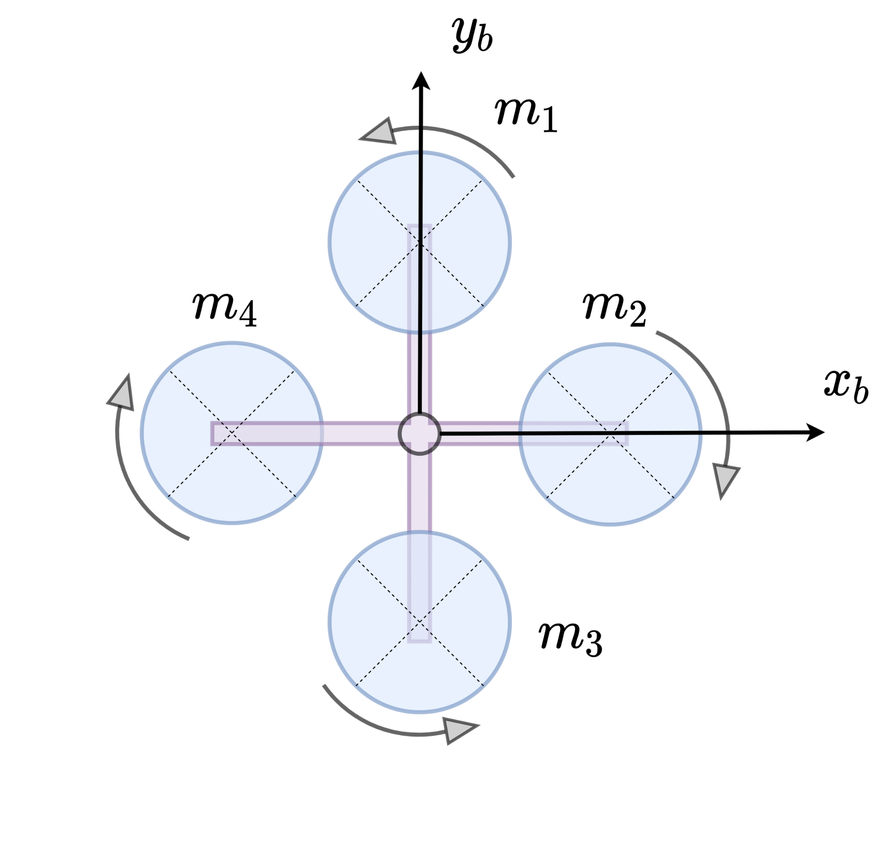

Конфигурация квадрокоптера типа «+». 

Получим следующие коэффициенты:


||Thrust cmd|Pitch cmd|Roll cmd|Yaw cmd|
|---|---|---|---|---|
|m1|1|1|0|-1|
|m2|1|0|-1|1|
|m3|1|-1|0|-1|
|m4|1|0|1|1|

Таким образом, команды управления формируются в соответствии со следующими
соотношениями:

$m_{1_{cmd}} = P_{des} + \dot{\omega_{des_x}} - \dot{\omega_{des_z}}$

$m_{2_{cmd}} = P_{des} - \dot{\omega_{des_y}} + \dot{\omega_{des_z}}$

$m_{3_{cmd}} = P_{des} - \dot{\omega_{des_x}} - \dot{\omega_{des_z}}$

$m_{4_{cmd}} = P_{des} + \dot{\omega_{des_y}} + \dot{\omega_{des_z}}$

## Моделирование полёта

Разделите визуализатор полёта БЛА и модель динамики. Подготовьте моделирование динамики в вашей программе и, используя UDP-пакеты, передайте вектор состояния (положение, ориентация, скорость и угловая скорость) в программу-визуализатор, в которой отображается полёт БЛА, и программу для отрисовки графиков.


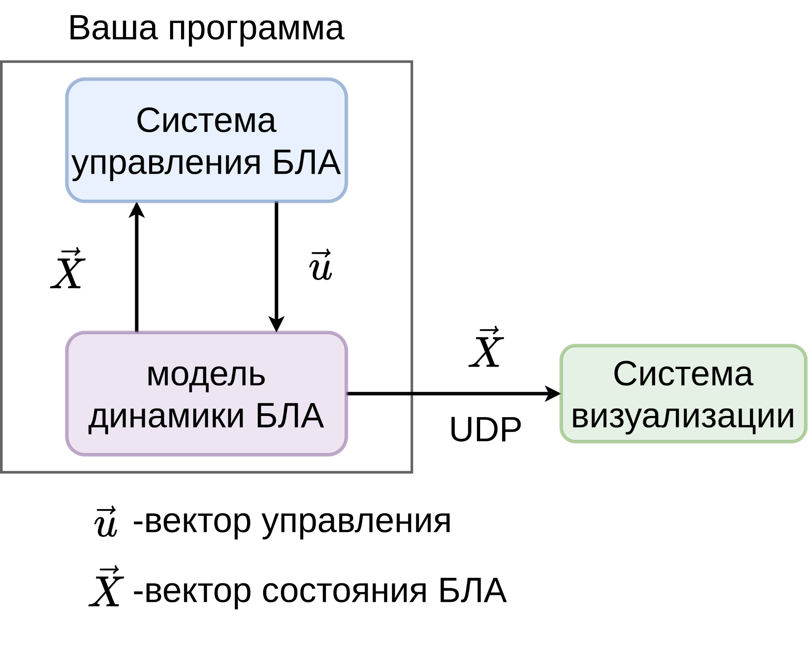


Структурная схема симулятора. 

В папке **src** вы найдёте шаблон для создания симулятора.
Для работы предлагаем использовать [виртуальное окружение Python](https://docs-python.ru/standart-library/modul-venv-python/).

Выполним создание и активацию среды виртуального окружения.

```bash
python -m venv venv
```

```bash
source venv/bin/activate
```

Установим модуль с шаблоном из папки src, c флагом **-e (editable)** для возможности отладки пакета.

```bash
pip install -e . 
```


Установим остальные зависимости.

```bash
pip install -r requirements.txt
```

В папке **scripts** вы найдёте файлы [plotter.py](scripts/plotter.py), [visualizer.py](scripts/visualizer.py), [simulator.py](scripts/simulator.py). Запустите эти программы с помощью команды `python3 <имя_файла>`.

Чтобы запустить визуализатор, выполните команду `python3 visualizer.py`.
В открывшемся окне вы увидите модель квадрокоптера
конфигурации «+».

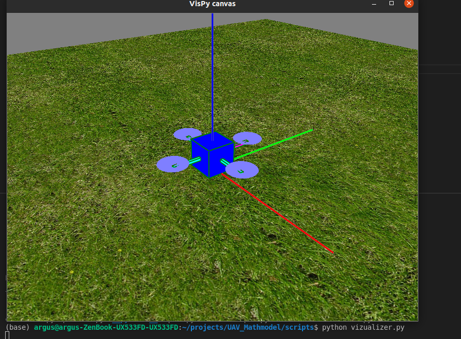

Скриншот: [GitLab]() / Skillbox

Чтобы воспользоваться программой построения графиков  [plotter.py](scripts/plotter.py), укажите номер компоненты вектора состояния, который нужно отобразить на графике при работе симулятора. Программа строит график в режиме реального времени, получая сообщения от программы симулятора, и отображает в нём указанную компоненту вектора состояния. Для удобства запустите приложение в разных окнах и укажите разные компоненты вектора состояния.


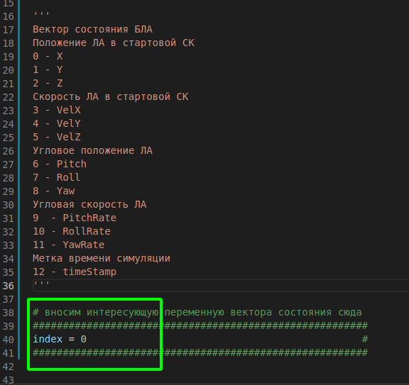

Скриншот: [GitLab]() / Skillbox

Чтобы протестировать визуализатор, используйте
вспомогательную программу [sendMessageExample.py](scripts/sendMessageExample.py), в которой вы увидите пример
отправки сообщения вектора состояния. 

## Программа испытаний симулятора

Для выполнения практической работы воспользуйтесь шаблоном кода в папке **src**. Вы можете дополнить её недостающими частями кода. Далее запустите [simulator.py](scripts/simulator.py) и настройте ПИД регулятора.

### Рекомендуемая программа испытаний

1. **Проверка работы матрицы поворотов.** 


- Возьмите единичный вектор
**X = (1,0,0)^T** и произвольные углы (например, крен = 0 , тангаж = 0, рыскание =
90°). 
- Умножьте матрицу поворота с заданными углами на вектор X_res
= R × X. В результате вы должны получить вектор **X_res = (0, 1, 0)**. 
- Для
обратного преобразования умножьте транспонированную матрицу на 
вектор. Равенство X = R^T × X_new должно быть справедливо. 
- Проведите
серию таких экспериментов с разными углами. Для
проверки корректности работы матрицы поворота воспользуйтесь [онлайн-сервисом 3D Rotation Converter](https://www.andre-gaschler.com/rotationconverter/).


2. **Проверка математической модели.** 

- Задайте произвольные угловые скорости
для аппарата, сделайте расчёт в вашей программы с помощью калькулятора. 
- Сравните результаты для одного шага работы
системы: если результаты идентичны, переходите к следующему
пункту испытаний.
- Проверьте правильность операций матричного умножения,
получения обратной матрицы, векторного произведения.

Онлайн-калькулятор для матричных операций есть [на сайте OnlineMSchool](https://ru.onlinemschool.com/math/assistance/matrix/multiply/).
Там же можно найти [калькулятор](https://ru.onlinemschool.com/math/assistance/vector/multiply1/) для проверки операции векторного произведения.

3. **Проверка интегратора.** 

- Задайте произвольное линейное и угловое ускорения.
- Проверьте, что компоненты скорости и положения начинают меняться. 
- Поменяйте знак у заданных ускорений, чтобы рост значений 
замедлился и в результате изменилось направление.

4. **Проверка алгоритма смешивания команд.** 

- Задайте произвольные команды
для каждого канала управления. 
- Проверьте, что положение аппарата меняется в заданных направлениях. 
- Проведите поочердную проверку команд.

5. **Отладка системы управления.**

При отладке системы управления рекомендуем
поочередно проверить и настроить контроллеры контуров
управления: от контура управления угловыми скоростями до
контура управления положением ЛА. 

- Выполните «Блокировку» движения ЛА по
всем осям, кроме вращения по одному из углов (например, задайте
константно 0 угловому и линейному ускорению по всем осям, кроме рысканья).
- Далее задайте в виде целевой угловой скорости константное значение
(например, 1 рад/сек). 
- Запустите программу, рассчитайте
параметры управления и правые части модели согласно полученной
в алгоритме смешивания команд угловой скорости. 
- Проследите за переходным процессом угловой скорости аппарата в канале рыскания: за
некоторое время она должна сходиться к заданному вами значению в 1 рад/сек.
Время, за которое аппарат сходится к заданному значению, должно быть не больше одной секунды (а лучше менее 0,1 сек), так как мы привели коэффициенты модели для маленького аппарата. Его динамики достаточно для такого быстрого отклика. 
- После успешных испытаний добавляйте другие
контуры управления по угловым скоростям. 
- Затем переходите к отладке
контуров управления угловым положением ЛА и к контурам
управления положением ЛА. 

Программа испытаний для всех контуров
управления аналогична: для отладки контура управления угловым
положением задайте угол в 0,7 радиан, а для контура
управления положением — произвольные координаты в стартовой СК (например, X = 1, Y = 1, Z = 3). Не забудьте установить ограничения на команды регуляторов в системе управления, чтобы избежать «эффекта удара» (kick) регулятора оборотов.

6. **Проверка полёта по заданным точкам (полётное задание)**. 

- Задайте несколько произвольных точек в пространстве и радиус попадания в точку R (например, 0,5 м). 
- При достижении аппаратом заданной точки в окрестности с заданным радиусом R отправьте на вход системы
управления новое пространственное положение. 
- Повторяйте все действия, пока не пролетите по всем точкам.

---

Также рекомендуем обратить внимание:


- На единицы измерения: используйте систему СИ, время в секундах, расстояние в метрах, угловое положение в радианах.

- Визуализацию результатов: для каждого эксперимента советуем построить графики переходных процессов для интерпретации результатов. Чтобы лучше понять работу системы, подготовьте графики для всех компонент вектора состояния.

---

Проверьте заданание. Для этого:

1) Постройте графики переходных процессов для разных контуров управления: компонент пространственного положения (X, Y, Z в стартовой СК) и углового положения (крен, тангаж, рыскание) от времени. При построении графиков укажите целевое положение аппарата, к которому он движется. Подготовьте графики для 5–8 точек, через которые аппарат должен пролететь.


2) Запишите видеодемонстрацию полёта аппарата по точкам. Установите программу для записи экрана (например, [kazam](https://linuxhint.com/install-kazam-ubuntu-22-04/) или [obs](https://obsproject.com/)) и снимите визуализатор, чтобы продемонстрировать работу системы.


---
